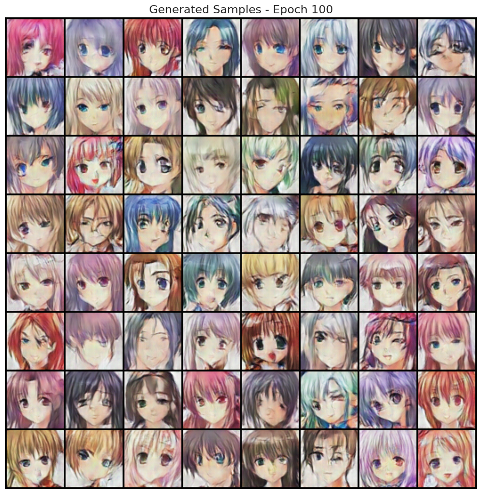
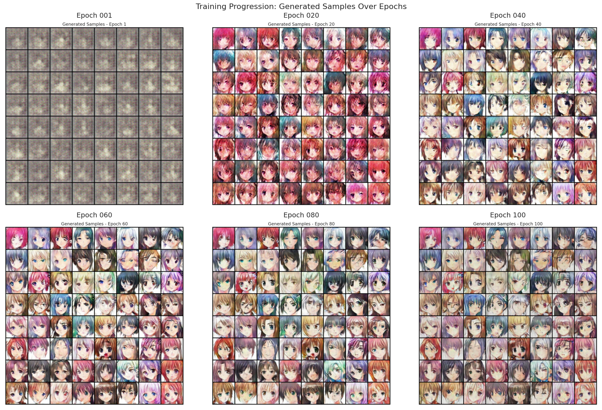

# Anime Face Generator

A deep learning project that generates realistic anime faces using a Deep Convolutional Generative Adversarial Network (DCGAN). This project demonstrates the power of adversarial training for generating novel, high-quality synthetic images.

## Overview

This project implements DCGAN to generate anime faces from random noise vectors. The model is trained on 10,000 images from the Anime Face Dataset (Kaggle), learning to produce convincing 64×64 RGB anime character faces.

### Final Results


**Key Achievements:**
- Successfully trained a stable GAN over 100 epochs
- Generated diverse, high-quality anime faces
- Demonstrated proper discriminator/generator balance
- Achieved convergence with smooth loss curves

## Model Architecture

### Generator
- **Input:** 100-dimensional noise vector
- **Architecture:** Dense → 4× ConvTranspose2d blocks → Tanh activation
- **Output:** 64×64×3 RGB anime face images
- **Parameters:** ~3.5M

### Discriminator
- **Input:** 64×64×3 RGB image
- **Architecture:** 4× Conv2d blocks → Sigmoid output
- **Output:** Real/fake probability (0-1)
- **Parameters:** ~2.8M

## Training Details

| Parameter | Value |
|-----------|-------|
| **Epochs** | 100 |
| **Batch Size** | 128 |
| **Learning Rate** | 0.0002 |
| **Optimizer** | Adam (β₁=0.5, β₂=0.999) |
| **Loss Function** | Binary Cross Entropy |
| **Training Time** | ~30 minutes (on GPU) |
| **Dataset Size** | 10,000 anime faces (64×64) |

## Dataset

- **Source:** [Anime Face Dataset on Kaggle](https://www.kaggle.com/datasets/splcher/animefacedataset)
- **Original Size:** 63,565 images
- **Training Sample:** 10,000 randomly selected images
- **Resolution:** Normalized to 64×64 pixels
- **Format:** RGB color images

## Getting Started

### Requirements
- Python 3.7+
- PyTorch
- NumPy, Matplotlib
- GPU (recommended for faster training)

### Running the Project

1. **Environment Setup:**
   ```bash
   pip install torch torchvision numpy matplotlib pillow
   ```

2. **Using Google Colab (Recommended):**
   - Upload `anime-gen.ipynb` to Google Colab
   - Enable GPU runtime: Runtime → Change runtime type → GPU
   - Upload dataset to Google Drive or use the provided path
   - Run all cells sequentially

3. **Local Execution:**
   ```bash
   jupyter notebook "anime-gen.ipynb"
   ```

## Project Structure

```
anime-face-generator/
├── final project - kelvin.ahiakpor.ipynb    # Main training notebook
├── final project - kelvin.ahiakpor.pdf      # Technical report (5 pages)
├── README.md                                 # This file
└── README.txt                                # Original documentation
```

## Results

The trained generator successfully produces:
- **Diverse anime faces** with varied styles, colors, and expressions
- **Smooth transitions** in the latent space
- **Stable training** with gradually improving image quality
- **Convergence** around epoch 50-60 with continued refinement

### Sample Outputs
The model generates convincing anime faces that demonstrate:
- Proper facial structure and proportions
- Varied hair styles and colors
- Different eye expressions
- Realistic skin tones and lighting

## Demo - Generated Results

### Training Progress (Every 20 Epochs)



## Training Progress

- **Early epochs (1-20):** Generator learns basic face structure
- **Mid epochs (20-60):** Detailed features emerge, discriminator calibrated
- **Late epochs (60-100):** Fine-tuning for visual quality and diversity

Loss curves show:
- Decreasing discriminator loss (increasing discrimination accuracy)
- Stabilizing generator loss (learning to fool discriminator)
- Proper balance preventing mode collapse

## Key Features

Stable DCGAN implementation  
Batch normalization for training stability  
Proper hyperparameter tuning  
Loss visualization and monitoring  
Face interpolation in latent space  
Generated face grid visualization  
Comprehensive documentation  

## Technical Highlights

- **Batch Normalization:** Used in all layers except generator input for stable training
- **Leaky ReLU:** Applied in discriminator to prevent zero gradients
- **Spectral Normalization Ready:** Architecture supports advanced training techniques
- **Modular Design:** Easy to extend or modify for different datasets

## Educational Value

This project demonstrates:
- Deep understanding of adversarial training dynamics
- Proper GAN architecture design principles
- Effective loss function and optimizer selection
- Image generation and neural network visualization
- PyTorch implementation best practices

## References

- Radford, A., Metz, L., & Chintala, S. (2016). *Unsupervised Representation Learning with Deep Convolutional Generative Adversarial Networks*
- Original DCGAN Paper: [arXiv:1511.06434](https://arxiv.org/abs/1511.06434)
- Anime Face Dataset: [Kaggle](https://www.kaggle.com/datasets/splcher/animefacedataset)

## Author

Kelvin Ahiakpor

## Acknowledgments

- Kaggle for the anime face dataset
- PyTorch community for excellent documentation
- Course instructors for guidance on GAN training

## Note
See the AnimeGen.pdf for a discussion on project details like training and areas of improvement.  

---
